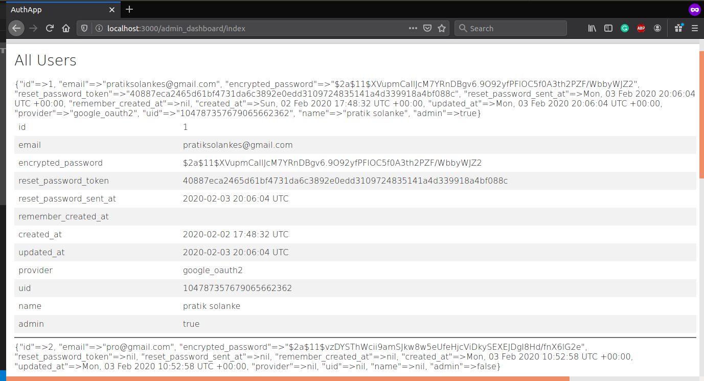

# SampleAuthApp
Sample RoR Authentication App. Built for Evie rampup
Authentication is done using Devise and Omniauth gems
<h1>Landing Page</h1>

<h1>Login Page</h1>

<h1>Sign in with Google</h1>

<h1>Admin Home Page</h1>

<h1>Edit Profile Page</h1>

<h1>Admin Dashboard Page (details of all registered users)</h1>

<h1>Sign up Page</h1>

<h1>User Home Page</h1>

